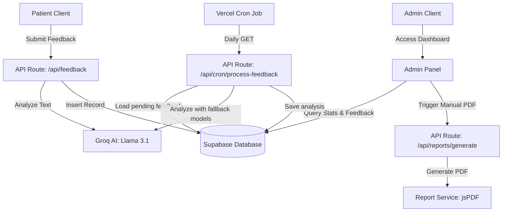

# Western Cape Public Hospital Feedback System

A production-ready, security-hardened web application designed for the Western Cape Department of Health to collect, analyze, and report on patient feedback from public hospitals. Built using **Next.js 14 (App Router)**, **TypeScript**, **Supabase (PostgreSQL + Auth SSR)**, and **Groq AI**.

---

## Table of Contents

- [Core Features](#core-features)
- [Technical Stack](#technical-stack)
- [System Architecture](#system-architecture)
- [Database Schema & Security (RLS)](#database-schema--security-rls)
- [AI Analysis & Graceful Degradation](#ai-analysis--graceful-degradation)
- [Report Generation & Automated Processing](#report-generation--automated-processing)
- [Quick Start Guide](#quick-start-guide)
- [Administrative Page Diagnostics](#administrative-page-diagnostics)
- [Troubleshooting & Maintenance](#troubleshooting--maintenance)
- [License](#license)

---

## Core Features

- **Patient Feedback Portal**
  - Secure registration and login powered by Supabase Auth SSR.
  - Multi-page feedback form supporting category selection and detailed experiences.
  - Personalized patient dashboard to track their own past submissions with live processing statuses.

- **Real-Time AI Processing**
  - Server-side analysis of patient comments using Groq Cloud API.
  - Determines sentiment, extracts a concise issue classification, and writes a short summary from a structured JSON response.
  - Configurable model fallback through `GROQ_MODELS`, with up to three attempts per model and a 15-second request timeout.
  - Graceful fallback: If AI is unavailable, the system saves feedback successfully with a `pending` status for later processing.

- **Admin Analytics Dashboard**
  - Overall key performance indicators (KPIs) showing submission volume, positive/negative/neutral ratios, and trends.
  - Interactive charts (using Recharts) for sentiment distributions and categorical breakdowns.
  - Real-time leaderboard showcasing top reported issues and per-hospital satisfaction comparisons.

- **Feedback Browser Page**
  - Dedicated admin workspace (`/admin/feedback`) for reviewing individual patient experiences.
  - Dynamic filtering by hospital name and rolling 12-month calendar dropdowns.
  - Fully details AI-extracted data, categories, and localized South African dates.

- **Anonymized Monthly PDF Reports**
  - Generates polished, government-compliant PDF summaries using `jsPDF` and `jspdf-autotable`.
  - Compiles monthly stats, AI-synthesized summaries per facility, top issues, and anonymized sample feedback comments (supporting POPIA compliance).
  - Admins can generate and download reports for the selected month from the reports page.

- **Automated Pending-Feedback Processing**
  - A Vercel Cron job runs daily at 02:00 and processes up to 25 feedback records with `pending` sentiment.
  - The cron endpoint is protected with `CRON_SECRET` and reports processed and failed record counts.

---

## Technical Stack

| Layer | Technology | Description |
| :--- | :--- | :--- |
| **Framework** | Next.js 14 (App Router) | React server components, secure server-side API routes. |
| **Language** | TypeScript | Strong typing across data models and API contracts. |
| **Database** | Supabase PostgreSQL | Relational database, indices, triggers, and Row Level Security. |
| **Authentication** | Supabase Auth SSR | Secure server-side and client-side authentication sessions. |
| **AI Integration** | Groq SDK (`llama-3.1-8b-instant`) | Ultra-fast LLM inference for sentiment analysis and summaries. |
| **Data Visualization** | Recharts | SVG charts optimized for React components. |
| **PDF Processing** | jsPDF + jspdf-autotable | Dynamic client/server PDF generation with strict formatting. |
| **Styling & Assets** | Tailwind CSS + Lucide Icons | Clean modern design matching Western Cape branding guidelines. |
| **Validation** | Zod | Server-side and client-side data schema validation. |

---

## System Architecture



---

## Database Schema & Security (RLS)

The system relies on PostgreSQL's native security features to protect sensitive patient records. All tables have **Row Level Security (RLS)** enabled, restricting operations to verified roles.

### Table Policies Overview

| Table | Patients (`patient` role) | Administrators (`admin` role) | Service Role |
| :--- | :--- | :--- | :--- |
| `profiles` | Read & Update own profile | Read all profiles | Read & Write all |
| `hospitals` | Read all | Read all | Read & Write all |
| `feedback` | Insert own, Read own submissions | Read all submissions | Read & Write all |

### Resolving RLS Recursion Loops

A common pitfall in Supabase is RLS policy recursion, which occurs when a policy checks the `profiles` table to verify roles, trigger-loading the policy itself. This project solves this recursion loop via two specialized database migrations:

1. **Security Definer Helper (`004_fix_rls_recursion.sql`)**
   A helper function `is_admin()` is declared with `SECURITY DEFINER` and `SET search_path = public`. It runs with superuser privileges, bypassing RLS checks to query user roles cleanly:
   ```sql
   CREATE OR REPLACE FUNCTION public.is_admin()
   RETURNS BOOLEAN AS $$
   BEGIN
     RETURN EXISTS (
       SELECT 1 FROM public.profiles
       WHERE id = auth.uid() AND role = 'admin'
     );
   END;
   $$ LANGUAGE plpgsql SECURITY DEFINER SET search_path = public;
   ```

2. **Self-Exclusion Policy (`005_fix_rls_recursion_trigger.sql`)**
   To prevent `is_admin()` from evaluating recursively on the administrator's own profile row inside the subquery, the profiles SELECT policy enforces a self-exclusion rule:
   ```sql
   CREATE POLICY "Admins can view all profiles"
     ON public.profiles FOR SELECT
     USING ( (id != auth.uid()) AND public.is_admin() );
   ```

---

## AI Analysis & Graceful Degradation

AI processing runs entirely **server-side** inside the `/api/feedback` route, ensuring `GROQ_API_KEY` is never exposed in client bundles.

1. **Prompt Engineering & Output Validation**
  The system supplies the patient's comment and category to Groq, requesting a structured JSON response specifying `sentiment` (`Positive`, `Negative`, or `Neutral`), an issue classification of up to five words, and a summary of up to 25 words. Server-side parsing accepts fenced or embedded JSON, normalizes sentiment casing, and rejects incomplete payloads.
2. **Model Fallback and Retries**
  Models are tried in the order configured in `GROQ_MODELS`. Each model receives up to three attempts with a short backoff; authentication and permission errors stop retries. Requests are cancelled after 15 seconds.
3. **Graceful Degradation Engine**
   If the Groq API key is missing, rate-limited, or throws an exception:
   - The user's feedback is **still saved** successfully in Supabase.
   - The `sentiment` field defaults to `pending` or `failed`.
   - The user is shown a success screen without interruption.
  - Admins can identify pending items in the dashboard; the daily cron job retries them automatically.

---

## Report Generation & Automated Processing

The monthly reporting pipeline aggregates regional feedback into a professional PDF.

- **Manual Generation**: Admins navigate to `/admin/reports`, choose a year and month, and click **Generate & Download PDF**. The authenticated `POST /api/reports/generate` route builds the report on demand and returns it as a PDF download.
- **Pending Feedback Cron**: Vercel calls `GET /api/cron/process-feedback` daily at 02:00 (`0 2 * * *`). The endpoint requires `Authorization: Bearer <CRON_SECRET>` and uses the service-role Supabase client to update pending records.
- Report generation is separate from the cron worker. The cron job processes AI analysis and does not email reports.

---

## Quick Start Guide

### 1. Pre-requisites
- Node.js 18+ installed.
- A Supabase Project (free tier is fine).
- A Groq Cloud account and API key.

### 2. Installation & Setup
Clone the repository, navigate to the source directory, and install dependencies:
```bash
git clone <repository-url>
cd wc-hospital-feedback/wc-hospital-feedback
npm install
```

### 3. Initialize Database Migrations
Go to your **Supabase SQL Editor** and execute the migration files in order:
1. [001_schema.sql](wc-hospital-feedback/supabase/migrations/001_schema.sql) — Initializes tables, profile hooks, and base policies.
2. [002_seed_hospitals.sql](wc-hospital-feedback/supabase/migrations/002_seed_hospitals.sql) — Populates 30+ regional public hospitals across 6 Western Cape districts.
3. [003_seed_demo_feedback.sql](wc-hospital-feedback/supabase/migrations/003_seed_demo_feedback.sql) *(Optional)* — Populates synthetic patient feedback for localized dashboard previews.
4. [004_fix_rls_recursion.sql](wc-hospital-feedback/supabase/migrations/004_fix_rls_recursion.sql) — Deploys the security definer function.
5. [005_fix_rls_recursion_trigger.sql](wc-hospital-feedback/supabase/migrations/005_fix_rls_recursion_trigger.sql) — Resolves the admin profiles select recursion loop.

### 4. Configure Environment Variables
Create a `.env.local` file from the provided template:
```bash
cp .env.example .env.local
```
Fill out the variables accordingly:
```env
NEXT_PUBLIC_SUPABASE_URL=https://your-project-id.supabase.co
NEXT_PUBLIC_SUPABASE_ANON_KEY=your-supabase-public-anon-key
SUPABASE_SERVICE_ROLE_KEY=your-supabase-service-role-key

GROQ_API_KEY=gsk_your_groq_api_key
GROQ_MODELS=openai/gpt-oss-20b,openai/gpt-oss-120b

CRON_SECRET=your-cron-secret
```

`GROQ_MODELS` is a comma-separated fallback list. `CRON_SECRET` must match the secret configured for the Vercel Cron request. The complete variable template is available in [`.env.example`](wc-hospital-feedback/.env.example).

### 5. Elevate First Admin Profile
1. Run the local server: `npm run dev`.
2. Navigate to `http://localhost:3000/register` and create an account.
3. Find your User UUID in the Supabase Authentication dashboard.
4. Execute this SQL query in the Supabase SQL Editor to elevate your user role:
   ```sql
   UPDATE public.profiles
   SET role = 'admin'
   WHERE id = 'your-user-uuid-here';
   ```

### 6. Local Testing Endpoints
- **Landing Page**: `http://localhost:3000`
- **Feedback Submission**: `http://localhost:3000/feedback`
- **My Submissions List**: `http://localhost:3000/my-feedback`
- **Admin Dashboard**: `http://localhost:3000/admin/dashboard`
- **Admin Feedback Browser**: `http://localhost:3000/admin/feedback`
- **Monthly PDF Hub**: `http://localhost:3000/admin/reports`

---

## Administrative Page Diagnostics

The Feedback Browser page (`/admin/feedback`) includes a server-side error boundary designed to catch database anomalies (such as missing environment variables or outdated RLS definitions).

If the page catches a database crash:
- It halts safely rather than showing a generic Next.js error screen.
- It displays a custom administration diagnostic interface.
- It prints the exact system error code and message.
- It provides a check-list of required variables and migrations (`004_fix_rls_recursion.sql`, `SUPABASE_SERVICE_ROLE_KEY`, etc.) for fast debugging.

---

## Troubleshooting & Maintenance

- **"Groq API key not configured"**
  - Ensure `GROQ_API_KEY` is set in `.env.local` or Vercel dashboard. Feedback will still be inserted with `pending` sentiment.
- **Admin pages redirect to /feedback**
  - Double check your profile role. Run `SELECT id, role FROM profiles;` in Supabase SQL editor and verify your profile contains `admin`.
- **Database error: policy recursion detected**
  - Verify that both `004_fix_rls_recursion.sql` and `005_fix_rls_recursion_trigger.sql` migrations have been successfully run in your Supabase project.
- **PDF Report output fails**
  - Check server-side logs. Make sure that the `hospitals` table has been seeded (`002_seed_hospitals.sql`) and that the selected month contains feedback.
- **Pending feedback is not processed**
  - Confirm `CRON_SECRET` is configured and that the request includes `Authorization: Bearer <CRON_SECRET>`. Check the Vercel Cron logs and confirm `GROQ_MODELS` contains currently available Groq model IDs.

---

## License

Distributed internally. Authorized for use by the Western Cape Department of Health only. Not for public redistribution.
